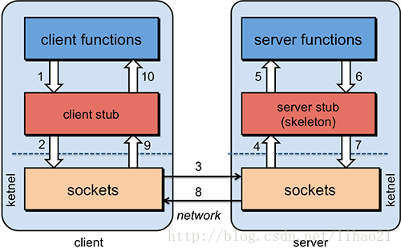
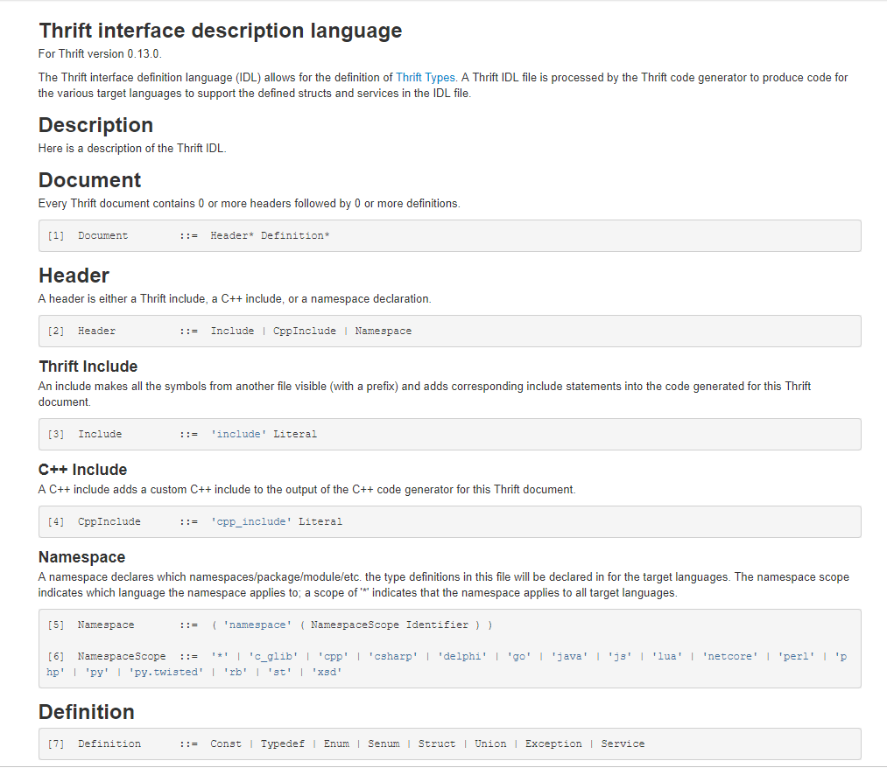
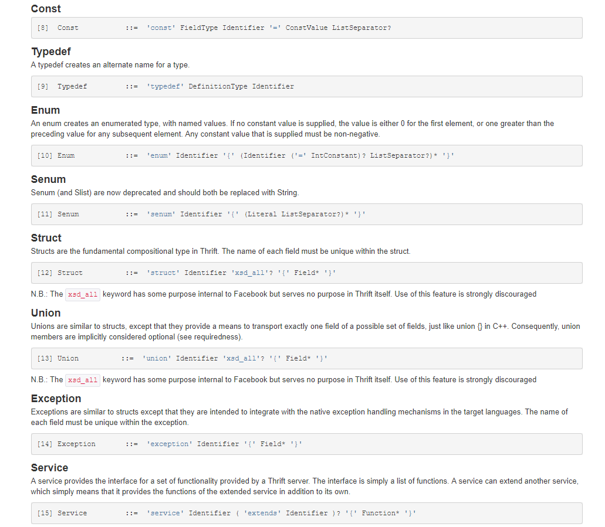
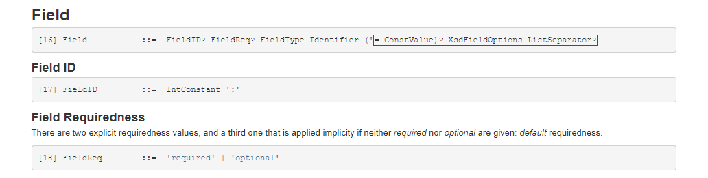

### RPC（Remote Procedure Call）
#### RPC框架通用开发步骤
1. 定义一个接口说明文件：描述了对象(结构体)、对象成员、接口方法等一系列信息；
2. 通过RPC框架所提供的编译器，将接口说明文件编译成具体的语言文件；
3. 在客户端和服务器端分别引入RPC编译器所生成的文件，即可像调用本地方法一样调用服务端代码；
#### RPC通信过程

1. 客户过程以正常方式调用客户端存根；
2. 客户端存根生成一个消息，然后调用本地操作系统；
3. 客户端操作系统将消息发送给远程操作系统；
4. 远程操作系统将消息交给服务器存根；
5. 服务器存根将参数提取出来，然后调用服务器过程；
6. 服务器执行要求的操作，操作完成后将结果返回给服务器存根；
7. 服务器存根将结果打包成一个消息，然后调用本地操作系统；
8. 服务器操作系统将含有结果的消息发送回客户端操作系统；
9. 客户端操作系统将消息交给客户端存根；
10. 客户端存根将结果从从消息中提取出来，返回给调用它的客户过程；

#### RPC 和RESTful API对比
- **资源粒度**：RPC 就像本地方法调用，RESTful API 每一次添加接口都可能需要额外地组织开放接口的数据，这相当于在应用视图中再写了一次方法调用，而且它还需要维护开发接口的资源粒度、权限等；
- **流量消耗**：RESTful API 在应用层使用 HTTP 协议，哪怕使用轻型、高效、传输效率高的 JSON 也会消耗较大的流量，而 RPC 传输既可以使用 TCP 也可以使用 UDP，而且协议一般使用二制度编码，大大降低了数据的大小，减少流量消耗。
- 对接异构第三方服务时，通常使用 HTTP/RESTful 等公有协议，对于内部的服务调用，应用选择性能更高的二进制私有协议。

#### Thrift 
##### Thrift Features
- interface description language-所有内容都在IDL文件中指定，可以从中生成许多语言的绑定
- language bindings- C++,C#,Cocoa,D,Delphi,Erlang,Haskell,Java,OCaml,Perl,PHP,Python,Ruby,Smalltalk
- namespaces-每个Thrift文件都在它自己的命名空间中，允许您在多个Thrift文件中使用相同的标识符
- language namespaces - 对于每个Thrift文件，您可以指定每种编程语言应该使用哪个名称空间
- base types - Thrift has a small set of base types. See Thrift Types
- constants and enumerations - 常量值可以分配逻辑名称
- structs - 使用结构体对相关数据进行分组。结构可以有任何类型的字段. See Thrift Types
- sparse structs - 未设置的可选基本类型字段和空的引用字段将不会通过网络发送
- struct evolution - 使用字段的整数标识符处理字段的添加和删除，而不会破坏现有客户端
- containers - 您可以使用任何类型的集合、列表和映射:基本类型、结构体和其他容器. See Thrift Types
- type definitions - 任何类型设置可以更好地描述它的名称
- services - A service is a group of functions
- service inheritance - 子服务实现其基类服务的所有功能，并可以具有其他功能
- asynchronous invocations - 不返回结果的函数可以异步调用，这样客户机就不会被阻塞，直到服务器完成对请求的处理。服务器可以并行/无序地执行同一客户机的异步调用
- exceptions - 如果发生错误，函数可以抛出标准异常或用户定义的异常. See Thrift Types
- cyclic structs - 从0.9.2版本开始，Thrift支持包含自身的结构体，或者稍后声明的其他结构体.
 ##### Thrift network stack
1. Server (single-threaded, event-driven etc) 
    - 服务器整合了上面描述的所有特性
       - 创建一个transport
       - 为transport创建输入/输出协议
       - 根据输入/输出协议创建处理器
       - 等待传入的连接并将它们传递给处理器
2. Processor (compiler generated)
    - 处理器封装了从输入流读取数据和向输出流写入数据的能力。输入和输出流由协议对象表示。
    - 特定于服务的处理器实现由编译器生成。处理器本质上从连接中读取数据(使用输入协议)，将处理委托给处理程序(由用户实现)，并通过连接(使用输出协议)编写响应。
3. Protocol (JSON, compact etc)
    - 协议实现控制编码方案并负责(反)序列化。在这个意义上，协议的一些例子包括JSON、XML、纯文本、压缩二进制文件等。
4. Transport  (raw TCP, HTTP etc)
    - 传输层为从网络到网络的读写提供了一个简单的抽象。这使得Thrift可以将底层传输与系统的其他部分(例如，序列化/反序列化)解耦。

 ##### TTransport层
代表thrift的数据传输方式，thrift定义了如下几种常用数据传输方式
- TSocket: 阻塞式socket；
- TFramedTransport: 以frame为单位进行传输，非阻塞式服务中使用；
- TFileTransport: 以文件形式进行传输；
 ##### TProtocol层
代表thrift客户端和服务端之间传输数据的协议，通俗来讲就是客户端和服务端之间传输数据的格式(例如json等)，thrift定义了如下几种常见的格式
- TBinaryProtocol: 二进制格式；
- TCompactProtocol: 压缩格式；
- TJSONProtocol: JSON格式；
- TSimpleJSONProtocol: 提供只写的JSON协议；
 ##### thrift支持的Server模型
- TSimpleServer: 简单的单线程服务模型，常用于测试；
- TThreadPoolServer: 多线程服务模型，使用标准的阻塞式IO；
- TNonBlockingServer: 多线程服务模型，使用非阻塞式IO(需要使用TFramedTransport数据传输方式);
- THsHaServer: THsHa引入了线程池去处理，其模型读写任务放到线程池去处理，Half-sync/Half-async处理模式，Half-async是在处理IO事件上(accept/read/write io)，Half-sync用于handler对rpc的同步处理；
 
##### Thrift IDL



###### 规则约束如下
**required**
> 如果在读取过程中缺少必需字段，则预期的行为是向调用者指示一个不成功的读取操作，例如抛出异常或返回错误。由于这种行为，
required字段极大地限制了与软版本控制相关的选项。因为字段必须在读取时出现，所以不能弃用它们。如果必须字段被删除(或更改为可选字段)，则数据在版本之间不再兼容。
- Write: 必填字段总是要写的，并且需要设置.
- Read: 必填字段总是被读取，并期望包含在输入流中.
- Defaults values: 总是写.
**optional**
> 大多数语言实现使用所谓的“isset”标志的推荐实践来指示是否设置了特定的可选字段。只有具有此标志集的字段才会被写入，相反，只有当从输入流读取了字段值时才会设置该标志。
- Write: 只有在设置了可选字段时才会写它们
- Read: 可选字段可以是输入流的一部分，也可以不是。.
- Default values: 在设置isset标志时写

##### Thrift Types
> Thrift类型系统旨在允许程序员尽可能多地使用本机类型，无论他们使用哪种编程语言。此信息基于并取代了Thrift白皮书中的信息。Thrift IDL提供了用于为每种目标语言生成代码的类型的描述。
1. Base Types
- bool: A boolean value (true or false)
- byte: An 8-bit signed integer
- i16: A 16-bit signed integer
- i32: A 32-bit signed integer
- i64: A 64-bit signed integer
- double: A 64-bit floating point number
- string: A text string encoded using UTF-8 encoding
2. Structs
> Thrift结构定义了一个公共对象——它们本质上等价于OOP语言中的类，但是没有继承。结构具有一组强类型字段，每个字段都具有唯一的名称标识符。字段可以有各种各样的注解(数值字段id、可选的默认值等)，这些注解在Thrift IDL中都有描述。
3. Containers
> Thrift容器是强类型容器，它映射到大多数编程语言中常用的和常用的容器类型。容器元素可以是任何有效的Thrift类型。为了获得最大的兼容性，map的键类型应该是基本类型，而不是结构或容器类型。有些语言在其本地映射类型中不支持更复杂的键类型。此外，JSON协议只支持作为基类型的键类型。
- list: 元素的有序列表。转换成STL向量、Java ArrayList、脚本语言中的本机数组等。
- set: 一组无序的唯一元素。翻译成STL集，Java HashSet, Python中的set，等等。注意:PHP不支持集合，所以它的处理类似于列表。
- map: 值的严格惟一键的映射。翻译成STL映射、Java HashMap、PHP关联数组、Python/Ruby字典等。
- thrift容器中元素的类型可以是除了service之外的任何类型，包括exception
4. Exceptions
> 异常在功能上等价于结构体，只是它们从每个目标编程语言中的本地异常基类继承，以便与任何给定语言中的本地异常处理无缝集成。
5. Services
> 服务是使用Thrift类型定义的。服务的定义在语义上等价于在面向对象编程中定义接口(或纯虚拟抽象类)。Thrift编译器生成实现接口的功能的客户端和服务器存根。
> 服务由一组命名函数组成，每个函数都有一个参数列表和一个返回类型。

##### Getting Started
- Download Apache Thrift
- Build and Install the Apache Thrift compiler
- Writing a .thrift file
```text
thrift --gen <language> <Thrift filename>
```